# 🎣 Enterprise Phishing Simulation Using Gophish on Kali Linux

**A controlled, end-to-end phishing simulation** built using **Gophish** on **Kali Linux** inside a VirtualBox VM, tunneled to the internet via **ngrok**. This project demonstrates the complete phishing attack lifecycle — from infrastructure setup and social engineering design through campaign execution, credential harvesting, and forensic analysis — all within an ethical, isolated lab environment.

> ⚠️ **Disclaimer:** This project is strictly for **educational purposes**. All targets were the project team's own email accounts with dummy credentials. Unauthorized phishing is illegal under the **IT Act 2000 (India)**, **CFAA (US)**, and similar laws worldwide.

---

## 📌 What This Repository Contains

This repository documents a professional phishing simulation project, including:

- 📘 Detailed explanation of all components and technologies used
- 🎯 Real-world use cases and edge cases with solutions
- 🛠️ Step-by-step implementation guide
- 📸 Screenshots of every stage of the simulation
- 📊 Campaign results and forensic analysis
- 📑 Project presentation (PPT)

---

## ⚡ Key Features & Highlights

- **Full Attack Lifecycle:** Covers reconnaissance → weaponization → delivery → exploitation → data capture
- **Real SMTP Delivery:** Uses Gmail SMTP (Port 587 + STARTTLS) with App Password authentication
- **Custom Landing Page:** Hand-crafted LinkedIn login clone with credential capture & auto-redirect
- **Social Engineering:** Leverages authority, urgency, and fear via a fake LinkedIn security alert email
- **Real-Time Tracking:** Monitors Email Sent → Opened → Link Clicked → Data Submitted per victim
- **Forensic Data:** Captures IP addresses, browser User-Agents, timestamps, and submitted credentials
- **Internet-Accessible:** ngrok reverse tunnel exposes the local phishing server to the public internet
- **Fully Ethical:** Self-targeted simulation with dummy data in an isolated VM environment

---

## 🏗️ Architecture Overview

```
┌─────────────────────────────────────────────────────────────────┐
│                        ATTACKER SIDE                            │
│                                                                 │
│  ┌──────────┐     ┌──────────┐     ┌──────────────────────┐    │
│  │ Kali VM  │────▶│ Gophish  │────▶│ Gmail SMTP (Port 587)│    │
│  │(Oracle   │     │ Server   │     │ (Sends phishing      │    │
│  │ VBox)    │     │ Port 80  │     │  emails)             │    │
│  └──────────┘     │ Port 3333│     └──────────────────────┘    │
│                   └────┬─────┘                                  │
│                        │                                        │
│                   ┌────▼─────┐                                  │
│                   │  ngrok   │                                  │
│                   │ Tunnel   │                                  │
│                   │ Port 80  │                                  │
│                   └────┬─────┘                                  │
└────────────────────────┼────────────────────────────────────────┘
                         │
                    Public Internet
                         │
┌────────────────────────▼────────────────────────────────────────┐
│                       VICTIM SIDE                               │
│                                                                 │
│  1. Receives phishing email in inbox                            │
│  2. Clicks "Review Recent Activity" link                        │
│  3. Sees fake LinkedIn login page (hosted via ngrok)            │
│  4. Enters credentials → captured by Gophish                   │
│  5. Redirected to real LinkedIn (victim suspects nothing)       │
│                                                                 │
└─────────────────────────────────────────────────────────────────┘
```

---

## 🛠️ Technologies Used

| Tool / Technology | Category | Purpose |
|-------------------|----------|---------|
| **Kali Linux** | Operating System | Penetration testing platform (host for all tools) |
| **Oracle VirtualBox** | Virtualization | Runs Kali Linux as a guest VM inside Windows |
| **Gophish v0.12.1** | Phishing Framework | Core simulation engine — sends emails, hosts pages, tracks results |
| **ngrok** | Tunneling Service | Exposes local Gophish server (port 80) to a public URL |
| **Gmail SMTP** | Email Delivery | Sends phishing emails via STARTTLS on port 587 |
| **HTML / CSS** | Web Technologies | Custom LinkedIn clone landing page |
| **SQLite** | Database | Stores all campaign data, credentials, and forensic logs |

---

## 📸 Screenshots & Demonstration

### Phase 1 — Infrastructure Setup

| Sending Profile (SMTP Config) | Landing Page (LinkedIn Clone) |
|:-----------------------------:|:-----------------------------:|
| 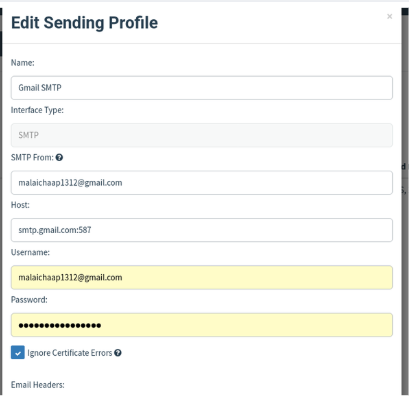 <br> *Gmail SMTP configured with App Password on port 587* | 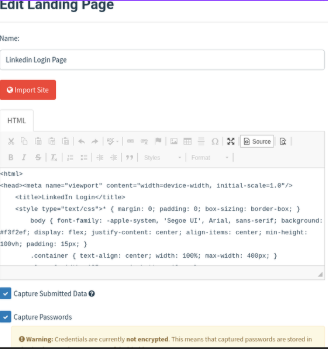 <br> *Custom HTML landing page with credential capture enabled* |

| Landing Page Preview | Email Template Editor |
|:--------------------:|:---------------------:|
| 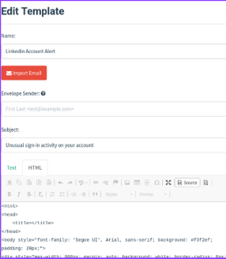 <br> *Pixel-perfect LinkedIn login page clone* | 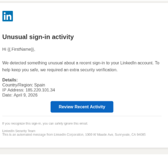 <br> *LinkedIn security alert template with Gophish variables* |

### Phase 2 — Campaign Design

| Email Template Preview | Target Group Setup |
|:---------------------:|:------------------:|
| 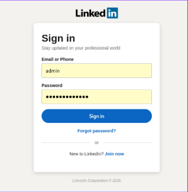 <br> *Phishing email rendered with social engineering elements* | 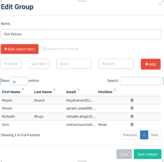 <br> *Test victim group with team members' own email accounts* |

### Phase 3 — Campaign Launch & Execution

| Campaign Configuration | Campaign Scheduled |
|:---------------------:|:------------------:|
| 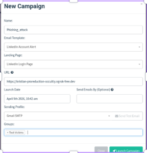 <br> *Assembling all components — template, page, profile, ngrok URL* | 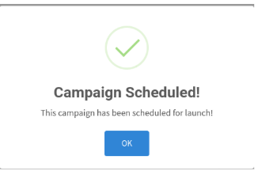 <br> *Campaign successfully scheduled for launch* |

| Initial Status (Sending) | Emails Delivered |
|:------------------------:|:----------------:|
| 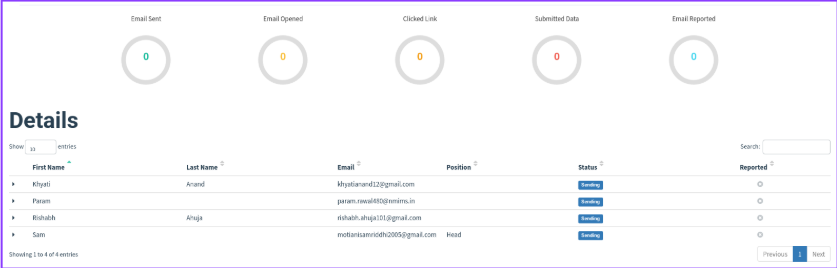 <br> *Real-time dashboard showing emails being sent to all 4 targets* | 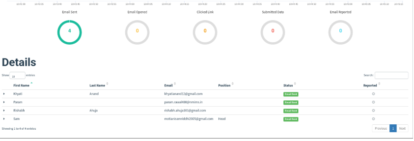 <br> *All 4 phishing emails successfully delivered* |

### Phase 4 — Victim Interaction & Results

| Phishing Email (Victim's Inbox) | Redirect to Real LinkedIn |
|:-------------------------------:|:-------------------------:|
| 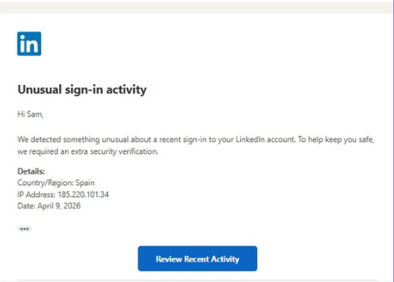 <br> *Victim receives the "Unusual sign-in activity" alert email* | 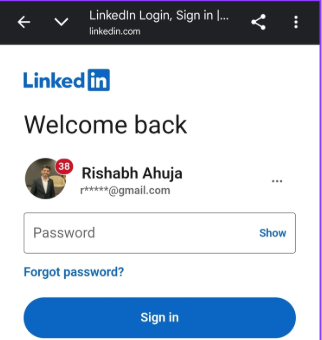 <br> *After credential submission, victim is redirected to the real LinkedIn* |

| Campaign Results Dashboard | Forensic Timeline (Captured Data) |
|:--------------------------:|:---------------------------------:|
| 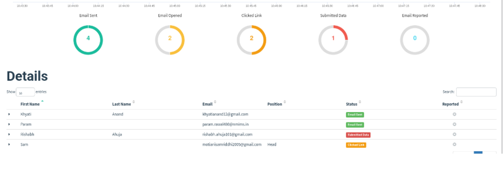 <br> *4 Sent, 2 Opened, 2 Clicked, 1 Submitted — real-time tracking* | 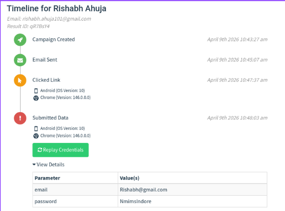 <br> *Full forensic timeline showing captured credentials, IP, browser info* |

---

## 🚀 How It Works (Step-by-Step)

### 1️⃣ Environment Setup
- Kali Linux runs inside VirtualBox with NAT networking
- Gophish is downloaded, extracted, and configured (`config.json`)
- ngrok creates a public HTTPS tunnel to Gophish's phishing server on port 80

### 2️⃣ Sending Profile Configuration
- Gmail SMTP is configured with host `smtp.gmail.com:587`
- Authentication uses a 16-character Google App Password (requires 2FA enabled)
- STARTTLS encryption secures the email transmission

### 3️⃣ Landing Page Creation
- A custom HTML page replicating LinkedIn's login page is built
- Form uses `method="POST"` with `name="email"` and `name="password"` fields
- **Capture Submitted Data** and **Capture Passwords** are enabled
- Redirect URL is set to the real LinkedIn login page

### 4️⃣ Email Template Design
- Mimics a LinkedIn security alert: *"Unusual sign-in activity on your account"*
- Uses Gophish template variables: `{{.URL}}`, `{{.FirstName}}`, `{{.Tracker}}`
- Embeds social engineering triggers — authority, urgency, and fear

### 5️⃣ Campaign Launch
- Target group of 4 team members' email addresses is created
- All components are assembled into a campaign with the ngrok URL
- Campaign is launched and Gophish begins sending emails

### 6️⃣ Tracking & Forensic Analysis
- **Real-time dashboard** tracks 4 events per victim: Sent → Opened → Clicked → Submitted
- **Forensic data** includes: IP address, OS, browser version, timestamps, and captured credentials
- Results can be exported as CSV or JSON for documentation

---

## 🎯 Use Cases

| # | Use Case | Actor | Outcome |
|---|----------|-------|---------|
| 1 | **Security Awareness Training** | IT Security / HR | Measure & reduce employee phishing susceptibility |
| 2 | **Red Team / Penetration Testing** | Ethical Hackers | Prove phishing as a viable attack vector with PoC |
| 3 | **Compliance Testing** | Auditors | Meet ISO 27001, NIST, PCI-DSS, HIPAA requirements |
| 4 | **Incident Response Drills** | SOC Team | Test detection and response to phishing attacks |
| 5 | **Academic Demonstration** ✅ | Students / Professors | Hands-on learning in a controlled lab environment |
| 6 | **Email Security Product Testing** | IT Admins | Validate email gateway effectiveness |

---

## ⚠️ Common Edge Cases & Troubleshooting

| Edge Case | Root Cause | Solution |
|-----------|-----------|----------|
| **SMTP Authentication Failure (535)** | Using regular password instead of App Password | Enable 2FA → Generate App Password |
| **SMTP Syntax Error (555)** | Malformed "From" field | Simplify to `youremail@gmail.com` |
| **Invalid Template Variable** | Using `{{.Date}}` (not supported) | Use only valid Gophish variables |
| **ngrok Tunnel Expired** | Free tier expires after ~2 hours | Restart ngrok, update campaign URL |
| **Port 80 Already In Use** | Another service (Apache/nginx) on port 80 | `sudo lsof -i :80` → `sudo kill <PID>` |
| **Email Goes to Spam** | Gmail spam filters flag phishing content | Check spam folder; enterprise setups whitelist IPs |
| **Tracking Pixel Blocked** | Email client blocks external images | Rely on "Clicked Link" and "Submitted Data" metrics |
| **Forgot Admin Password** | Password set at first login was lost | Reset via SQLite: update bcrypt hash in `gophish.db` |

---

## 🔐 Security & Ethical Considerations

| Aspect | Detail |
|--------|--------|
| **Legal Compliance** | All activities comply with IT Act 2000 (India) — only self-targeted |
| **Authorization** | Only the project team's own email accounts were used |
| **Data Handling** | All captured credentials are dummy/test data |
| **Environment** | Isolated VirtualBox VM — no real user data was harvested |
| **Purpose** | Strictly educational, conducted under academic supervision |
| **Disclosure** | Clearly documented as a simulation — not for malicious use |

### Relevant Indian Cyber Law (IT Act 2000)

| Section | Offence | Punishment |
|---------|---------|------------|
| **Section 66** | Computer-related offences (unauthorized access) | Up to 3 years + ₹5 lakhs fine |
| **Section 66C** | Identity theft | Up to 3 years + ₹1 lakh fine |
| **Section 66D** | Cheating by personation using computer | Up to 3 years + ₹1 lakh fine |

---

## 📁 Repository Structure

```
Phishing/
├── README.md                        # This file
├── 1_explanation (1).md             # Detailed A-Z project explanation
├── 3_use_cases_edge_cases.md        # Use cases, edge cases & attack surface analysis
├── implementation_plan.md           # Step-by-step implementation guide
├── PHISHING ATTACK.pptx             # Project presentation
└── Implementataion_ss/              # Screenshots of the full demonstration
    ├── step1.png                    #   → Sending Profile (SMTP config)
    ├── step2.png                    #   → Landing Page editor (HTML)
    ├── step2.1.png                  #   → Email template preview
    ├── step3.1.png                  #   → LinkedIn clone login page
    ├── step3.2.png                  #   → Email template editor
    ├── step4.png                    #   → Target group setup
    ├── step5.png                    #   → Campaign configuration
    ├── step5.1.png                  #   → Campaign scheduled confirmation
    ├── step6.png                    #   → Campaign status — sending
    ├── step6.1.png                  #   → Campaign status — all sent
    ├── step7.png                    #   → Phishing email in victim's inbox
    ├── step7.1.png                  #   → Redirect to real LinkedIn
    ├── step8.png                    #   → Campaign results dashboard
    └── step8.1.png                  #   → Forensic timeline & captured credentials
```

---

## 📊 Campaign Results Summary

| Metric | Count | Description |
|--------|:-----:|-------------|
| **Emails Sent** | 4 | Phishing emails delivered to all targets |
| **Emails Opened** | 2 | Tracking pixel confirmed 2 opens |
| **Links Clicked** | 2 | 2 victims clicked "Review Recent Activity" |
| **Data Submitted** | 1 | 1 victim entered credentials on the fake page |
| **Emails Reported** | 0 | No victims reported the phishing email |

### Forensic Sample (Captured Data)
| Field | Value |
|-------|-------|
| **Victim** | Rishabh Ahuja |
| **Result ID** | qR7BsY4 |
| **Device** | Android (OS Version: 10) |
| **Browser** | Chrome (Version: 146.0.0.0) |
| **Clicked Link** | April 9th 2026, 10:47:37 AM |
| **Submitted Data** | April 9th 2026, 10:48:03 AM |
| **Captured Email** | Rishabh@gmail.com |
| **Captured Password** | NmimsIndore |

> **Note:** All credentials above are dummy test data entered by team members for demonstration purposes.

---

## 🛡️ Defensive Measures (Key Takeaways)

| Layer | Defense | How It Helps |
|-------|---------|--------------|
| 👤 **People** | Security awareness training | Employees learn to recognize phishing emails |
| 📋 **Process** | Phishing reporting button | Easy mechanism to flag suspicious emails |
| 🔧 **Technology** | SPF / DKIM / DMARC | Prevents email domain spoofing |
| 🔧 **Technology** | Multi-Factor Authentication (MFA) | Stolen passwords alone can't grant access |
| 🔧 **Technology** | Email security gateways | Filters phishing before delivery (Proofpoint, Mimecast) |
| 🔧 **Technology** | URL sandboxing | Scans links in emails before users can click them |

---

## 🔮 Future Scope

| Extension | Description |
|-----------|-------------|
| Multi-channel simulation | Add SMS phishing (smishing) alongside email |
| AiTM with Evilginx | Demonstrate real-time MFA bypass |
| AI-generated templates | Use LLMs to auto-generate personalized phishing lures |
| Phishing awareness portal | Build a training platform for users who fail the sim |
| SIEM integration | Send Gophish events to Splunk/ELK for enterprise monitoring |
| Red Team automation | Script the full campaign lifecycle with Gophish REST API |

---

## 📚 References

- [Gophish Official Documentation](https://docs.getgophish.com)
- [Gophish GitHub Repository](https://github.com/gophish/gophish)
- [Kali Linux Documentation](https://www.kali.org/docs/)
- [ngrok Documentation](https://ngrok.com/docs)
- [MITRE ATT&CK — T1566 (Phishing)](https://attack.mitre.org/techniques/T1566/)
- [Verizon 2024 Data Breach Investigations Report](https://www.verizon.com/business/resources/reports/dbir/)
- [IBM Cost of a Data Breach Report 2024](https://www.ibm.com/security/data-breach)
- Information Technology Act, 2000 (India)
- Digital Personal Data Protection Act, 2023 (India)

---

## 📜 License

This project is for **educational and academic purposes only**.  
Unauthorized use of phishing tools against individuals or organizations without explicit written consent is **illegal** and **unethical**.

---

## 🙋 Contact

For questions or academic collaboration:

- 📧 Email: rishabh.ahuja101@gmail.com
- 🐛 Issues: [Open an Issue](../../issues)
